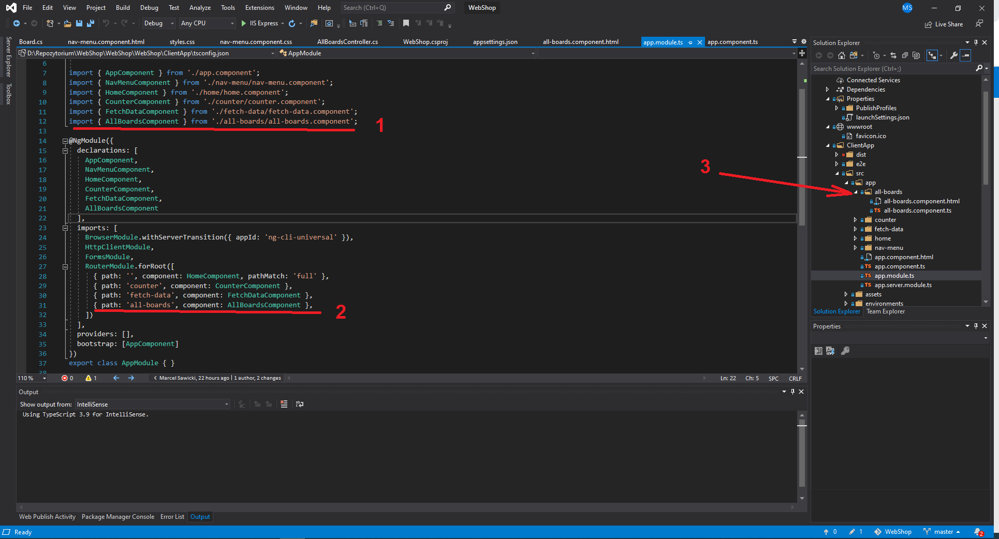

Jak dodać komponent:  

1. Dopisujemy import klasy nowo dodawanego komponentu (np. AllBoardsComponent) w pliku app.module.ts.  
2. Definujemy takze routing dla tego, nowo dodawanego komoponentu.  
3. Zakładamy katalog komponentu w ktorym umieszamy jego definicje (all-boards.component.ts) oraz szablon (w pliku html)  